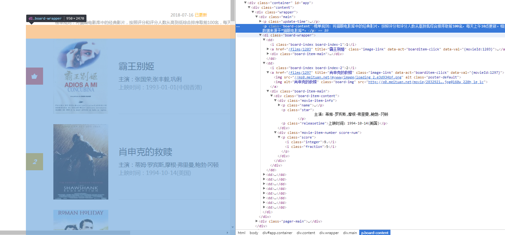
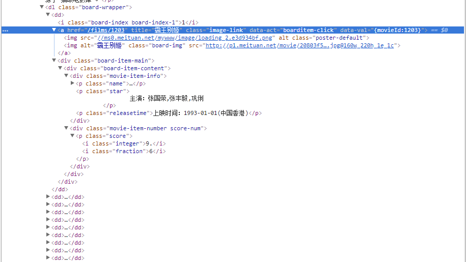
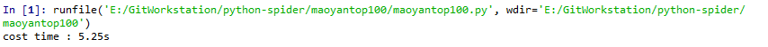
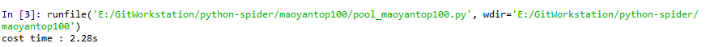
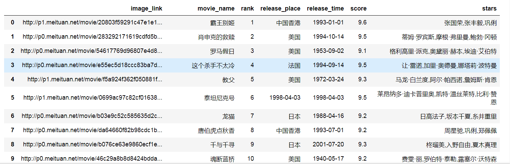

## 使用Requests+BeautifulSoup爬取猫眼排名前100电影

## 1 爬取过程分析

### 1.1 爬取的网址分析

爬取的网址为：https://maoyan.com/board/4?offset=0，每一页有十部电影，共有10页，通过网址链接中的offset参数=0，10,20, ..., 90来区分。每一页包括的信息有电影海报、电影名字、主演、上映时间、上映地点、排名、评分这七项内容。下图为第一页显示的内容：


HTML结构如下图：



从HTML结构中可以看出，每一部电影的信息存储在标签`<dd>...</dd>`中。

### 1.2 爬取一部电影的电影海报、电影名字、主演、上映时间、上映地点、排名、评分

一部电影中的HTML结构如下：
 


#### 1.2.1 爬取电影名

- 通过查看HTML结构，可以看出电影名位于类`board-content下的标签<dd>下的标签<a>中的title键中`。

- 先导入相关的库，并请求链接：
```python
import requests
from bs4 import BeautifulSoup
import re
import json
import pandas as pd

url = 'https://maoyan.com/board/4?offset=0'
headers = {'user-agent':'Mozilla/5.0'}
res = requests.get(url, headers=headers)
soup = BeautifulSoup(res.text, 'html.parser')
```
> 注意：这里一定要`加上浏览器端的HTTP头部信息header`，把我们的请求伪装成浏览器，否则返回的res.text会警告禁止访问猫眼网址。

- 用BeautifulSoup进行解析电影名称：
```python
movie_name = soup.select('.board-wrapper dd a')[0]['title']
```

>`movie_name = soup.select('.board-wrapper dd a')`会返回一个列表，里面的元素为所有的`位于类board-content下的标签<dd>下的标签<a>中的内容`，即`所有电影的名称`。我们取列表中的第一个元素，然后取其键title中的值。

#### 1.2.2 爬取主演

```python
stars = soup.select('.board-wrapper .star')[0].text.lstrip('\n                主演：').rstrip('\n ')
```

>主演信息在`类board-wrapper下的类star中`，返回一个列表，列表中的每一个元素包含了每一部的电影的主演信息。我们取第一个元素中的文本信息，并去除格外的字符。

#### 1.2.3 爬取上映时间

```python
release_time = soup.select('.board-wrapper .releasetime')[0].text.split('上映时间：')[-1].split('(')[0]
```

>上映时间信息在`类board-wrapper下的类releasetime中`，返回一个列表，列表中的每一个元素包含了每一部的电影的上映时间信息。我们取第一个元素中的文本信息，并去除格外的字符。

#### 1.2.4 爬取上映地点

```python
release_place = soup.select('.board-wrapper .releasetime')[0].text.split('上映时间：')[-1].split('(')[-1].split(')')[0]
```

>上映地点信息与上映时间信息大同小异，也在`类board-wrapper下的类releasetime中`，返回一个列表，列表中的每一个元素包含了每一部的电影的上映地点信息。我们取第一个元素中的文本信息，用split()函数去除上映时间的信息，提取出上映地点信息。

#### 1.2.5 爬取排名

```python
rank = soup.select('.board-wrapper dd i')[0].text
```

>排名信息在`类board-wrapper下的标签<dd>下的标签<i>中`，返回一个列表，列表中的每一个元素包含了每一部的电影的排名。我们取第一个元素中的文本信息，就抓取到了排名信息。

#### 1.2.6 爬取评分

```python
score = soup.select('.board-wrapper dd i')[1].text + soup.select('.board-wrapper dd i')[2].text
```

>评分信息由两部分组成，第一部分包含了整数部分，第二部分包含了小数部分。`整数部分`在`类board-wrapper下的标签<dd>下的标签<i>中`，不过`处于列表中的第二个元素`，`小数部分`与整数部分类似，也在`类board-wrapper下的标签<dd>下的标签<i>中`，不过`位于列表中的第三个元素`。将提取的两个字符串相加，即抓取了评分信息。

#### 1.2.7 爬取海报的图片链接

```python
image_link = soup.select('.board-wrapper dd img')[1]["data-src"]
```

>海报图片在`类board-wrapper下的标签<dd>下的标签中`，返回了一个列表，而真正的图片链接位于列表中的第二个元素中的键data-src中。

### 1.3 爬取一页中的每个电影
```python
def one_page_parser(soup):
    '''
    Desc:
        用于解析单页的电影信息内容，并返回一个电影信息列表
    param:
        soup -- 用BeautifulSoup解析的单页的内容
    return:
        movies -- 单页的电影信息列表，列表中的每一个元素存储了一个字典，字典中包含了一部电影信息
    '''
    index = list(range(0,20,2)) #遍历每一页中的每个电影，这里列表为[0,2,4,...,18],因为每一部电影的有两个标签<a>
    movies = [] #列表中的每一个元素存储了一个字典，字典中包含了一部电影信息
    for i in index:
        movie_info = {}
        #1电影名字
        movie_name =  soup.select('.board-wrapper dd a')[i]['title']
        #2主演
        stars = soup.select('.board-wrapper .star')[int(i/2)].text.lstrip('\n                主演：').rstrip('\n ')
        #3上映时间
        release_time = soup.select('.board-wrapper .releasetime')[int(i/2)] \
        .text.split('上映时间：')[-1].split('(')[0]
        #4上映地点
        release_place = soup.select('.board-wrapper .releasetime')[int(i/2)] \
        .text.split('上映时间：')[-1].split('(')[-1].split(')')[0]
        #5排名
        rank = soup.select('.board-wrapper dd i')[int(i/2*3)].text
        #6得分
        score = soup.select('.board-wrapper dd i')[int(i/2*3)+1].text + \
        soup.select('.board-wrapper dd i')[int(i/2*3)+2].text
        #7海报图片链接
        image_link = soup.select('.board-wrapper dd img')[i+1]["data-src"] #0,1,2表示第一步影片

        movie_info['movie_name'] = movie_name #电影名字
        movie_info['stars'] = stars #主演
        movie_info['release_time'] = release_time #上映时间
        movie_info['release_place'] = release_place #上映地点
        movie_info['rank'] = rank #排名
        movie_info['score'] = score #得分
        movie_info['image_link'] = image_link #海报图片链接
        movies.append(movie_info)
    return movies
```

### 1.3 将单页的电影信息保存到本地的json格式中

```python
def write_to_file(movies_list):
    '''
    Desc:
        将单页的电影信息列表存储为json格式
    param:
        movies_list -- 单页的电影信息列表
    '''
    file_name = 'pool_movies.json'
    with open(file_name, 'a', encoding='utf-8') as f:
        f.write(json.dumps(movies_list, ensure_ascii=False) + '\n')
        f.close()
```

### 1.4 改变每页的offset参数进行多页的抓取

```python
movies_lists = []
for i in range(10):
    url = 'https://maoyan.com/board/4?offset=' + str(i*10) #总共10页，构建每一页的url
    soup = get_one_page_soup(url)
    movies_list = one_page_parser(soup)
    movies_lists.extend(movies_list)
    write_to_file(movies_list)
##3.使用pandas整理数据
df = pd.DataFrame(movies_lists)
```

## 2 汇总成一个python文件

```python
# -*- coding: utf-8 -*-
"""
Created on Mon Jul 16 19:48:31 2018

@author: Xavier
"""

import requests
from bs4 import BeautifulSoup
import re
import json
import pandas as pd
from multiprocessing import Pool
import time

def get_one_page_soup(url):
    '''
    Desc:
        用BeautifulSoup解析一页中的电影信息，并返回单页的soup信息
    param:
        url -- 单页的链接地址
    return:
        soup -- 用BeautifulSoup解析的单页的内容
    '''
    headers = {'user-agent':'Mozilla/5.0'}
    res = requests.get(url, headers=headers)
    soup = BeautifulSoup(res.text, 'html.parser')
    return soup


def one_page_parser(soup):
    '''
    Desc:
        用于解析单页的电影信息内容，并返回一个电影信息列表
    param:
        soup -- 用BeautifulSoup解析的单页的内容
    return:
        movies -- 单页的电影信息列表，列表中的每一个元素存储了一个字典，字典中包含了一部电影信息
    '''
    index = list(range(0,20,2)) #遍历每一页中的个电影
    movies = [] #列表中的每一个元素存储了一个字典，字典中包含了一部电影信息
    for i in index:
        movie_info = {}
        #1电影名字
        movie_name =  soup.select('.board-wrapper dd a')[i]['title']
        #2主演
        stars = soup.select('.board-wrapper .star')[int(i/2)].text.lstrip('\n                主演：').rstrip('\n ')
        #3上映时间
        release_time = soup.select('.board-wrapper .releasetime')[int(i/2)] \
        .text.split('上映时间：')[-1].split('(')[0]
        #4上映地点
        release_place = soup.select('.board-wrapper .releasetime')[int(i/2)] \
        .text.split('上映时间：')[-1].split('(')[-1].split(')')[0]
        #5排名
        rank = soup.select('.board-wrapper dd i')[int(i/2*3)].text
        #6得分
        score = soup.select('.board-wrapper dd i')[int(i/2*3)+1].text + \
        soup.select('.board-wrapper dd i')[int(i/2*3)+2].text
        #7海报图片链接
        image_link = soup.select('.board-wrapper dd img')[i+1]["data-src"] #0,1,2表示第一步影片

        movie_info['movie_name'] = movie_name #电影名字
        movie_info['stars'] = stars #主演
        movie_info['release_time'] = release_time #上映时间
        movie_info['release_place'] = release_place #上映地点
        movie_info['rank'] = rank #排名
        movie_info['score'] = score #得分
        movie_info['image_link'] = image_link #海报图片链接
        movies.append(movie_info)
    return movies


def write_to_file(movies_list):
    '''
    Desc:
        将单页的电影信息列表存储为json格式
    param:
        movies_list -- 单页的电影信息列表
    '''
    file_name = 'pool_movies.json'
    with open(file_name, 'a', encoding='utf-8') as f:
        f.write(json.dumps(movies_list, ensure_ascii=False) + '\n')
        f.close()

def main(offset):
    url = 'https://maoyan.com/board/4?offset=' + str(offset) #总共10页，构建每一页的url
    soup = get_one_page_soup(url)
    movies_list = one_page_parser(soup)
    for movies_list in one_page_parser(soup):
        print(movies_list)
        write_to_file(movies_list)

    
    # ##3.使用pandas整理数据
    # df = pd.DataFrame(movies_lists) 
    # print(df)


if __name__ == '__main__':
    start_time = time.time()
    pool = Pool()
    pool.map(main, [i*10 for i in range(10)])
    end_time = time.time()
    print("cost time : %.2fs" % (end_time-start_time))
```
>使用线程pool.map()方法来加速爬取，第一个参数为函数名，第二个参数为函数的参数，这里用一个数组构造。

## 3 运行结果分析

- 不使用线程和使用线程速度比较

>不使用线程：

>使用线程:


- 使用pandas进行显示

- 输出的json文件可以查看
[json](movies.json)

