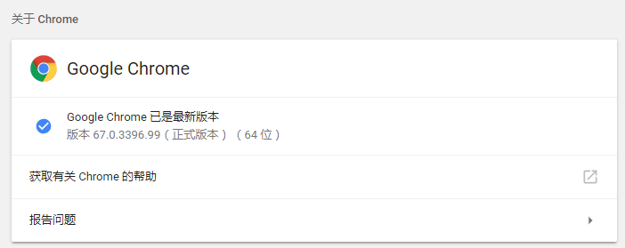
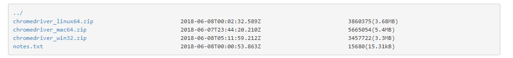
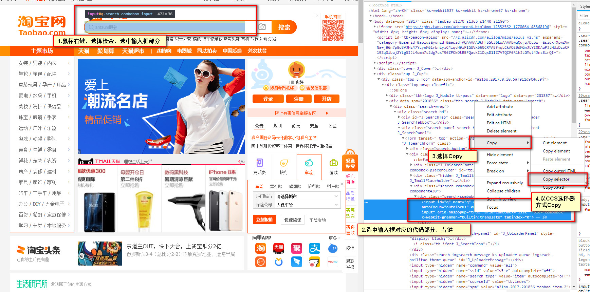
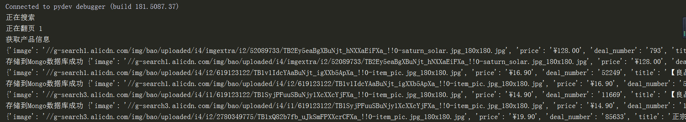
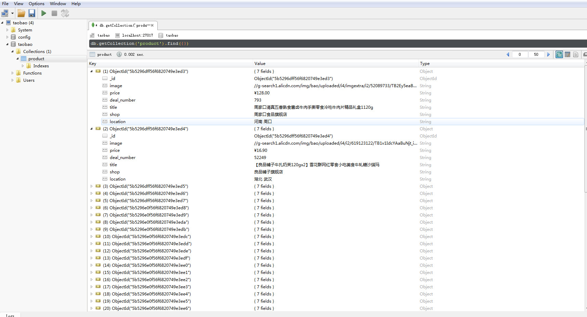

## 1 软件安装
### 1.1 Selenium的安装 
- Selenium是一个自动化测试工具，利用它我们可以驱动浏览器执行特定的动作，如输入文字、点击、下拉等操作 。 对于一些 JavaScript 谊染的页面来说，这种抓取方式非常有效 。 
- 使用Anaconda安装：在Anaconda的Environment下搜索Selenium即可安装。
### 1.2 驱动Chrome浏览器的chromedriver的安装
- Chromedriver:只有安装 ChromeDriver，才能配合Selenium驱动 Chrome 浏览器完成相应的操作。
- 第一步，查看Chrome浏览器的版本。
> 打开Chrome浏览器，选择右上角的菜单栏，选择帮助->关于Google Chrome(G)。如下图，我已更新到版本67.0。

- 第二步，下载对应版本的Chromedriver。
> 百度搜索Chromedriver，即可在镜像网址http://npm.taobao.org/mirrors/chromedriver/中下载对应于Chrome版本的Chromedriver。版本67.0的Chrome可以下载2.40版本的Chromedriver。可以在文件http://npm.taobao.org/mirrors/chromedriver/2.40/notes.txt查看对应Chrome版本的Chromedriver版本。再根据需求下载Chromedriver即可。

- 第三步，将Chromedriver添加到环境变量中。
> 下载解压后，需要把chromedriver.exe文件`所在目录添加到环境变量`中。这里就不多讲了，百度上有很多教程。

> 测试时候安装成功:打开cmd，输入chromedriver，回车。出现以下画面即表示安装成功。如若不是，由于重新配置了环境变量，可以重启下电脑，再试一下。

### 1.3 安装MongoDB和Robo 3T
- 第一步，去官网https://www.mongodb .com/download-center下载MongoDB，这里选择Community Server即可。


- 第二步， 将MongoDB配置成系统服务，这样就能在每次需要MongoDB时就自动连接到MongoDBs数据库。
```shell
mongod --bind_ip 0.0.0.0 --logpath "C:\Program Files\MongoDB\Server\4.0\logs\mongodb.log"  --logappend --dbpath "C:\Program Files\MongoDB\Server\4.0\data\db" --port 27017 --serviceName "MongoDB" --serviceDisplayName "MongoDB" --install
```
>这里的--bind_ip 0.0.0.0表示连接的地址
>--logpath "C:\Program Files\MongoDB\Server\4.0\logs\mongodb.log"  --logappend表示指定日志文件
>--dbpath "C:\Program Files\MongoDB\Server\4.0\data\db"  表示指定数据库
>--port 27017 --serviceName "MongoDB" --serviceDisplayName "MongoDB" 表示指定端口和服务名

- 第三步，下载MongoDB的可视化操作软件Robo 3T（https://robomongo.org/）


## 2 开始爬取淘宝美食
### 2.1 查看淘宝美食站点

### 2.2 建立taobao_meishi.py，导入相关的库，使用selenium模拟一个Chrome浏览器驱动，并在淘宝网址上搜索美食关键字。
- selenium的使用可以查看[python selenium的官方手册](https://selenium-python.readthedocs.io/waits.html)
```python
from selenium import webdriver
from selenium.webdriver.common.by import By
from selenium.webdriver.support.ui import WebDriverWait
from selenium.webdriver.support import expected_conditions as EC
from selenium.common.exceptions import TimeoutException
from bs4 import BeautifulSoup
from configure import *
import pymongo

browser = webdriver.Chrome()
wait = WebDriverWait(browser, 10) #等待
keyword = '美食'

def search(keyword):
    '''
    Desc:
        模拟搜索关键字keyword，并点击搜索按钮，进行跳转
    param:
        keyword -- 搜索用的关键词
    return:
        total.text -- 当前关键字下的总页数
    '''
    try:
        print('正在搜索')
        browser.get('https://www.taobao.com/') #模拟浏览器进入淘宝网
        #等待直到局部元素显示出来,这里的局部元素为淘宝网页搜索框部分
        input = wait.until(
            EC.presence_of_element_located((By.CSS_SELECTOR, "#q"))
        )
        #等待直到元素可被点击,这里的元素为搜索按钮
        submit = wait.until(EC.element_to_be_clickable((By.CSS_SELECTOR, '#J_TSearchForm > div.search-button > button')))
        input.send_keys(keyword) #在输入框调用send_keys方法模拟输入关键字
        submit.click() #模拟点击搜索按钮操作
        #点击之后，等待页面刷新，这里的条件为直到局部元素显示出来,这里的局部元素为下一页的总页数部分
        total = wait.until(EC.presence_of_element_located((By.CSS_SELECTOR, '#mainsrp-pager > div > div > div > div.total')))
        return total.text
    #发生延时异常时，重新调用search()方法
    except TimeoutException:
        search(keyword)
```
### 2.3 用BeautifulSoup解析每一页的产品信息，并保存到MongoDB数据库中。
```python
def get_products():
    '''
    Desc:
        使用BeautifulSoup解析每一个产品的信息（图片、价格、付款人数、标题、店铺名、店铺地点）
    '''
    #等待每一个图片元素加载出来
    print('获取产品信息')
    wait.until(EC.presence_of_element_located((By.CSS_SELECTOR, "#mainsrp-itemlist .items .item")))
    html = browser.page_source
    soup = BeautifulSoup(html, 'html.parser')
    items = soup.select('#mainsrp-itemlist .items .item')
    for item in items:
        product = {
            'image': item.select('.pic img')[0]['src'],
            'price': item.select('.price')[0].text.strip(),
            'deal_number': item.select('.deal-cnt')[0].text[:-3],
            'title': item.select('.title')[0].text.strip(),
            'shop': item.select('.shop')[0].text.strip(),
            'location': item.select('.location')[0].text.strip()
        }
        print(product)
        save_to_mongo(product) #保存到Mongo数据库中
```
### 2.4 用selenium模拟执行翻页操作
```python
def next_page(page_number):
    '''
    Desc:
        输入下一页页码，并点击确定，进行跳转
    param:
        page_number -- 搜索下一页的页码
    '''
    try:
        print('正在翻页', page_number)
         #等待直到局部元素显示出来,这里的局部元素为到第[2]页中的[..]
        input = wait.until(
            EC.presence_of_element_located((By.CSS_SELECTOR, "#mainsrp-pager > div > div > div > div.form > input"))
        )
        #等待直到元素可被点击,这里的元素为输入页码后的的确定按钮
        submit = wait.until(EC.element_to_be_clickable((By.CSS_SELECTOR, '#mainsrp-pager > div > div > div > div.form > span.btn.J_Submit')))
        input.clear() #清除当前输入框中的内容
        input.send_keys(page_number) #把下一页的页码传入输入框中
        submit.click() #模拟点击确定按钮，跳转到下一页的操作
        #点击之后，等待页面刷新，这里的条件为直到局部元素显示出来,这里的局部元素为数字页码在填充方框这个元素中
        wait.until(
            EC.text_to_be_present_in_element((By.CSS_SELECTOR, \
                                              '#mainsrp-pager > div > div > div > ul > li.item.active > span'), str(page_number))
                  )
        get_products() #解析每一页产品的信息
    #发生延时异常时，重新调用next_page(page_number)方法
    except TimeoutException:
        next_page(page_number)
```
### 2.5 存储到MongoDB数据库中
-  建立configure.py，配置MongoDB数据库地址、数据库名、表。
```
MONGO_URL = 'localhost'
MONGO_DB = 'taobao'
MONGO_TABLE = 'product'
```
- 在taobao_meishi.py中添加保存到MongoDB数据库中的代码。
```python
def save_to_mongo(result):
    try:
        if db[MONGO_TABLE].insert(result):
            print('存储到Mongo数据库成功', result)
    except Exception:
        print('存储到Mongo数据库失败', result)
```
### 2.6 汇总，执行main()函数
```python
def main():
    total = search(keyword)
    #使用strip方法去除字符串中的不需要的内容，取出其中的数字
    #也可以使用正则表达式, \d表示匹配任意的一个10进制数，+表示匹配前边的原子1次或多次
    #total = int(re.compile('(\d+)').search(total).group(1))
    total = int(total.lstrip('共 ').rstrip(' 页，'))
    for i in range(1,2):
        next_page(i)

if __name__ == '__main__':
    main()
```
## 3 查看结果
### 3.1 运行结果

### 3.1 Robo 3T 数据库结果
- 连接到localhost数据库地址和端口，建立名为taobao的数据库，点击Test测试成功后Save。


- 查看数据库中的数据。


